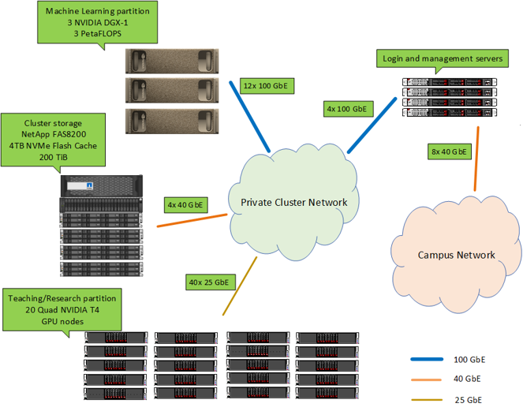

## Compute Infrastructure

ROSIE has 3 different types of computational processing nodes. There is a total of 27 compute nodes on the cluster.

| Name | Node Count | Processor | CPU Count | RAM | GPU | IP Address |
|----------|---------|-------|--------|-----|----|----|
| Management | 4 | Intel Xeon Gold 6240 @ 2.601GHz | 72 | 187G | No GPU | 10.199.0.20[1-4] |
| T4 | 20 | Intel Xeon Gold 6240 @ 2.60GHz | 72 | 376G | 4x Tesla T4 | 10.199.0.[1-20] |
| DGX-1 | 3 | Intel Xeon CPU E5-2698 v4 @ 2.20GHz | 80 | 503G | 8x Tesla V100-SXM2 | 10.199.0.10[1-3] |

## Storage Pools

ROSIE has two high speed access 90TB storage nodes.

1. The first storage device stores the home folder for every cluster user.
2. The second storage devices holds the `/data` resource share. This contains datasets and code samples for faculty and students researching with the clusters compute resources.

Both of these data pools are mounted to each cluster compute node at the same mountpoint.

This means that from any machine on the cluster, you can access your home folder files and research data files with the same filepaths.

## Software Stack

More details in **Command Line Interface**

* SLURM Documentation [link](https://slurm.schedmd.com/documentation.html)
* Singularity Documentation [link](https://sylabs.io/guides/3.3/user-guide/index.html)

On any node on the cluster, execute these commands to read detailed information about the commands.

```bash
  $ man srun
  $ man sbatch
  $ singularity --help
```