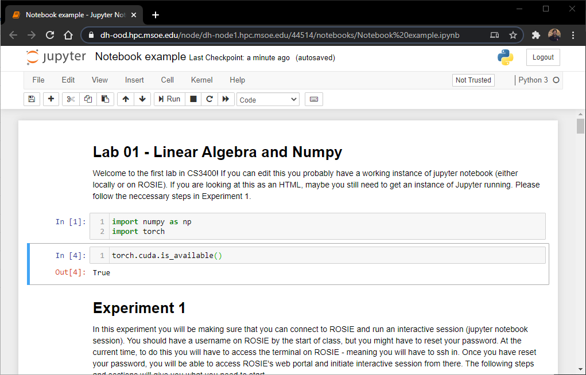
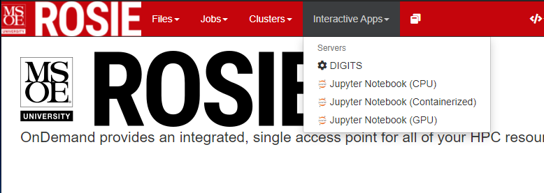
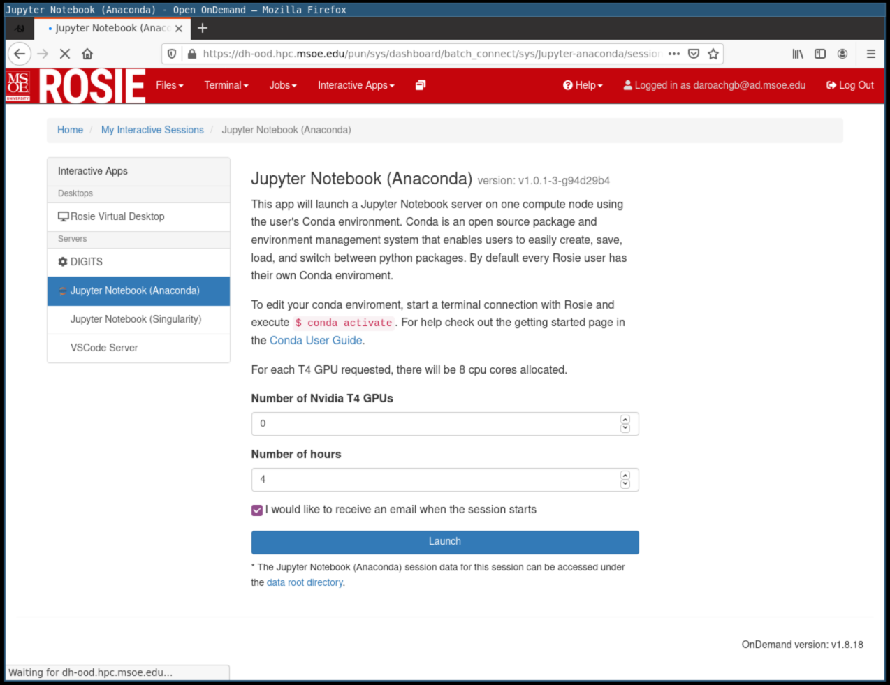

Log into the [ROSIE Web Portal](http://dh-ood.hpc.msoe.edu) with your ROSIE username and password. Click on the Interactive Apps dropdown menu in the toolbar. From here you can launch a jupyter notebook web server for some amount of user specified time.

**Note:** The shell access button will launch a terminal right in your browser. You can view and manage files on the node during the allocated time.

## Launching Jupyter Notebook Server

To launch the server, click the interactive apps dropdown button on the web portal navigation bar.

You can then choose the server type and launch options.

## Server Types

| Name                    | CPU | GPU | Notes                             |
|-------------------------|-----|-----|-----------------------------------|
| Jupyter (CPU)           | Yes | No  | Userspace python environment.     |
| Jupyter (GPU)           | Yes | Yes | Userspace python environment with accelerated computing hardware. |
| Jupyter (Containerized) | Yes | Yes | Containerized python environment with accelerated computing hardware. Use for managed library environments. |

## Installing Python Packages

You can install python packages inside of the jupyter notebook servers.

**CPU** or **GPU**

You can install packages in a notebook cell by executing:

`!pip install <packagename>`

**Containerized Instance**

The container's system directory is read-only. You can install a python package in userspace with the `--user` flag.

`!pip install <packagename> --user`.

**Example installation in containerized ipynb server**

## Accessing data

The jupyter notebook server will have access to your home directory at `/home/username`. Additionally, the cluster datapool will be mounted at `/data`. You can read/write files from the datapool with your scripts.